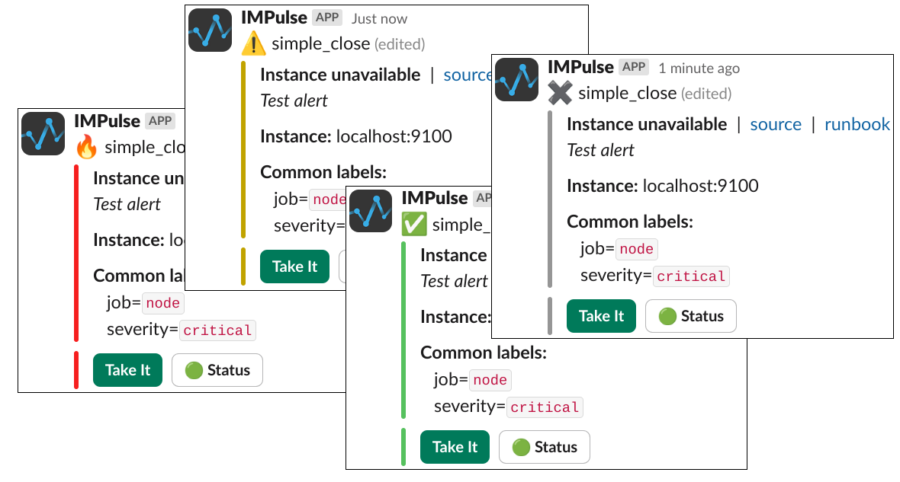

# Incident Management Program

We build IMPulse with engineers, for engineers — and we actually listen.

<!--  -->

Designed for DevOps, platform teams, and security-focused engineering orgs.

## Open-source. Fast. Simple. Now with Google Calendar integration!

---

## Why IMPulse?

| Problem | IMPulse Solution |
|:-|:-|
| Alerts go to everyone — or no one | Smart routing → right person, right time, no spam |
| Tired of bloated enterprise tools | Lightweight, clean UI, no extra noise |
| Not sure who’s on call? | Google Calendar sync shows everything at a glance |
| Need reliable Slack/Telegram alerts | Stable, tested integrations (Slack, Telegram, Mattermost) |
| Full control and customization | You own the code. Extend it as needed. |
| Need setup today, not next sprint | Deploy in minutes via Docker |
| Can’t trust black-box vendors | Fully open source, self-hosted, no data leaks |

## Key Features and Integrations

|||
|-|-|
|**Slack, Telegram, Mattermost Integrations** Stable, tested integrations — receive alerts where your team already communicates||
||**Google Calendar Integration** Easily sync on-call shifts with your calendar. Always know who’s on duty|
|**On-Call Scheduler** Assign shifts, manage rotations, avoid overlaps — all in minutes||
||**Alert Routing** Send alerts only to the right person, at the right time. Zero spam, zero chaos|
|**Open Source & Self-Hosted** Full control over infrastructure and data. No lock-in, no third-party backend||
||**Fast Setup with Docker** Deploy in minutes with minimal dependencies. Works out of the box|
|**Privacy by Design** No tracking, no extra logging, no data leaks. Perfect for sensitive environments||
||**Customizable** Need something special? Fork it, extend it, or contribute — your stack, your rules|
|**Community Support** Active Telegram group and GitHub discussions. Quick feedback and feature shaping||

Got a bug, feature idea or integration request?
Contact Us

{}

<--->

<--->

{}